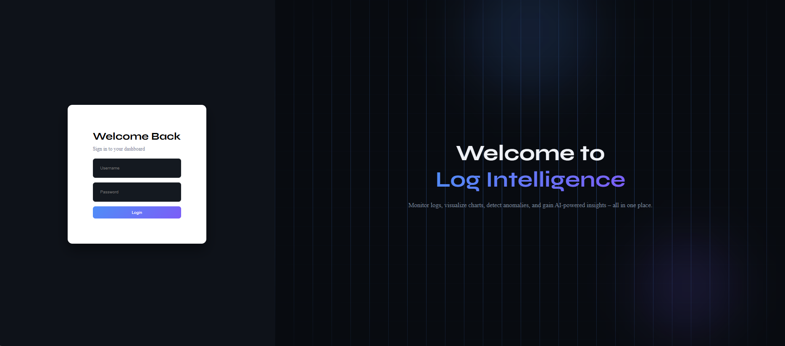
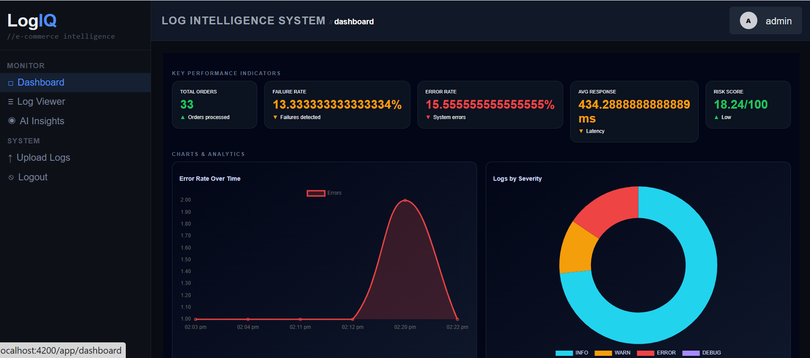
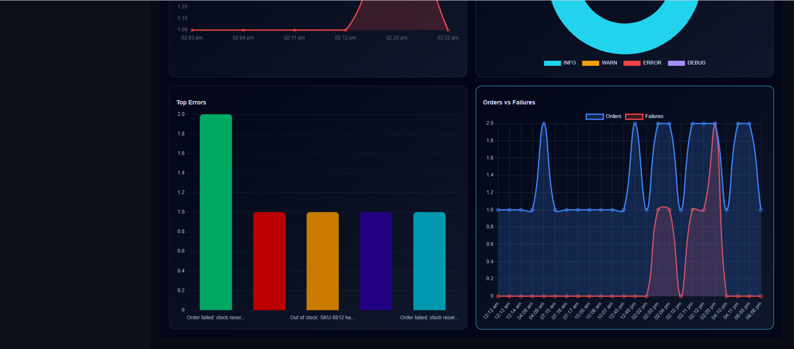
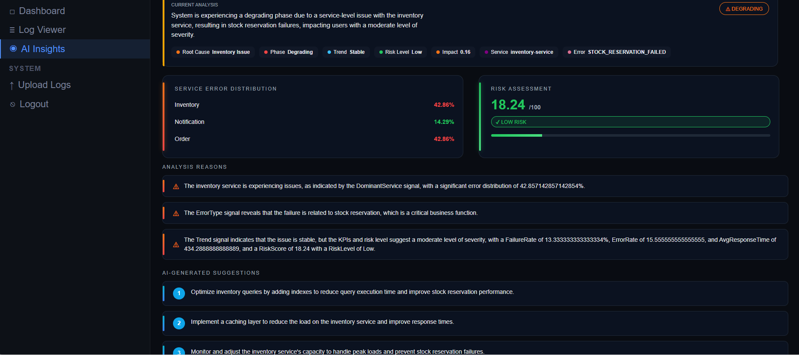
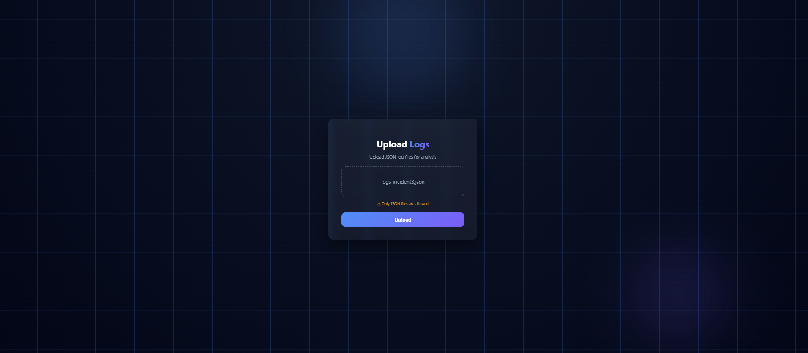
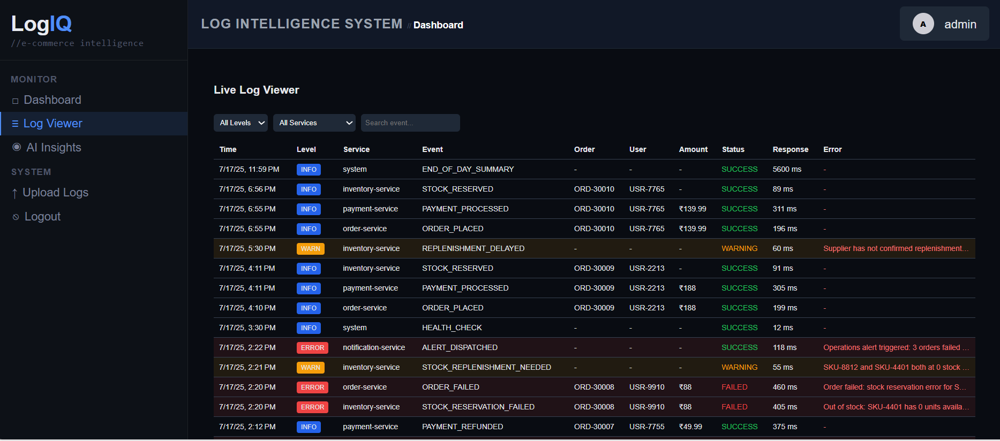

#  Log Intelligence Dashboard
 
A full-stack **Log Intelligence Dashboard** for an e-commerce system that combines **system monitoring, business KPIs, and AI-powered insights**.
 
---
 
##  Features
 
### Role-Based Access Control
 
| Role               | Access                                           |
| ------------------ | ------------------------------------------------ |
| **Primary User**   | Upload logs, KPIs, charts, AI insights, raw logs |
| **Analytics User** | Upload logs, KPIs, charts, AI insights           |
| **Log Viewer**     | View raw logs only                               |
 
---
 
## Log Ingestion
 
* Upload structured **JSON log files**
* Logs represent e-commerce events:
 
  * Order placement
  * Payment success/failure
  * System performance
* Backend parses and stores logs in database
 
---
 
## KPIs (Key Performance Indicators)
 
* Total Orders
* Failure Rate (%)
* Error Rate (%)
* Average Response Time
* Risk Score (based on anomalies)
 
---
 
##  Visualizations
 
* Error Rate Over Time (Line Chart)
* Logs by Severity (Pie Chart)
* Orders/Traffic Over Time
* Top Errors (Bar Chart)
 
---
 
## Live Log Viewer
 
* View raw logs in real-time
* Filters:
 
  * Severity (INFO / WARN / ERROR)
  * Time range
  * Search keywords
 
---
 
##  AI Insights
 
* Incident Summary
* Risk Level (Low / Medium / High)
* Recommended Actions
 
---
 
##  Backend Architecture
 
* **Controllers** → Handle API requests
* **Services** → Business logic (KPIs, parsing, insights)
* **Repositories** → Database access
* **Models** → Entities (Log, User)
* **DTOs** → API responses
 
---
 
## Tech Stack
 
* Angular (Frontend UI)
* ASP.NET Core Web API
* Entity Framework Core
* SQL Server
* Chart.js / ng2-charts
* HuggingFace (AI Insights)
 
---
 
##  Run the Project
 
### Backend
 
```bash
cd Backend
dotnet run
```
 
### Frontend
 
```bash
cd Frontend
npm install
ng serve
```
 
---
 
##  Screenshots
 
###  Home Page
 

 
### KPIs Dashboard
 

 
###  Charts & Analytics
 

 
###  AI Insights
 

 
###  Upload Logs
 

 
###  Live Log Viewer
 

 
